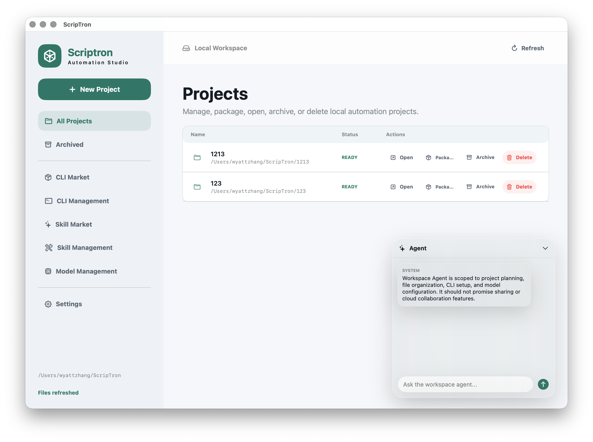
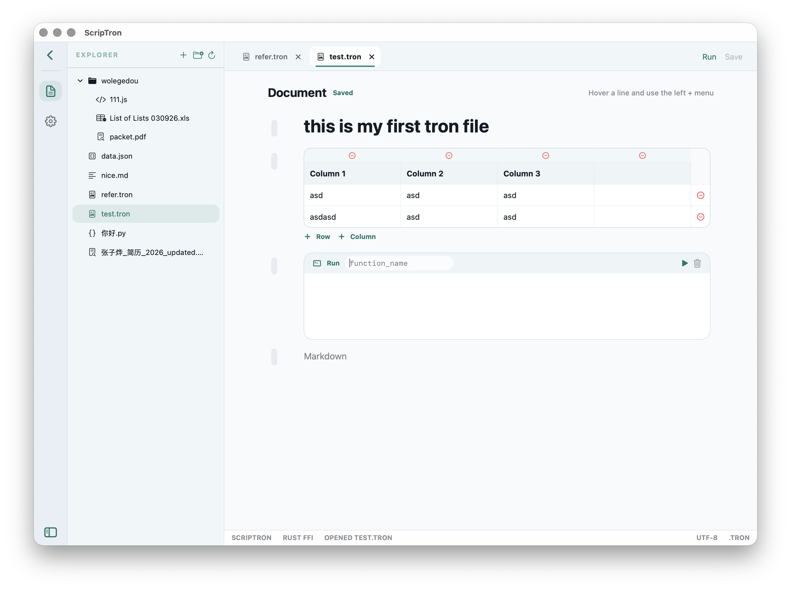
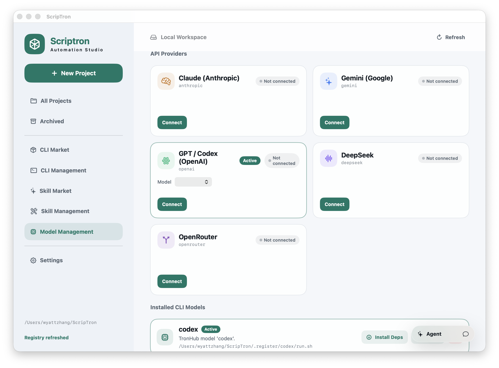
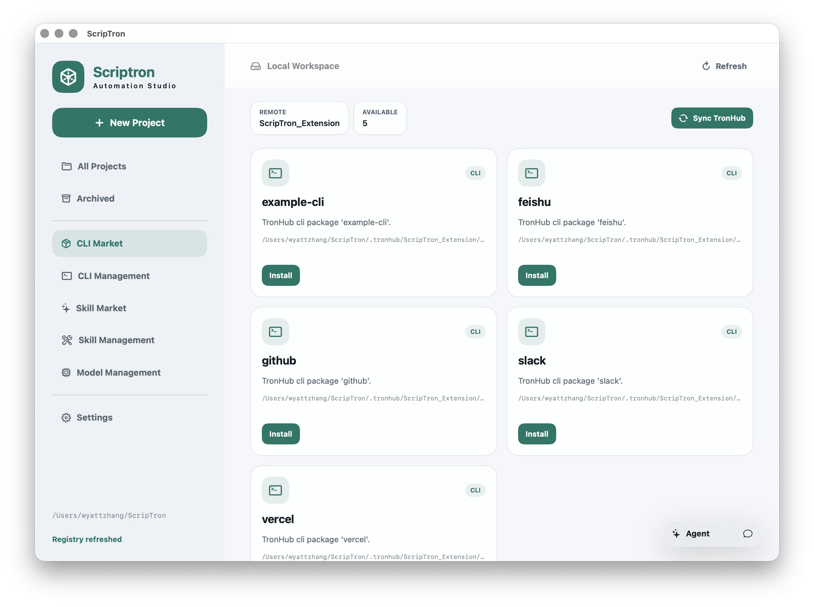
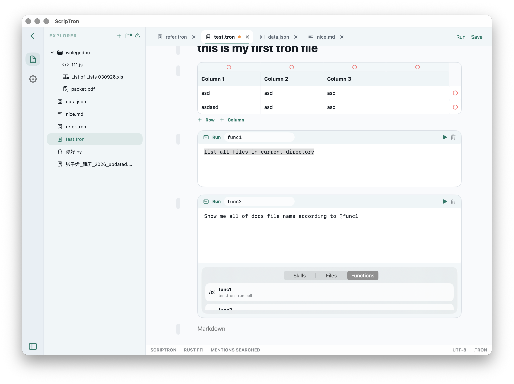

<div align="center">

# ScripTron

**Local-first automation studio for macOS — run LLM agents on `.tron` documents.**

[简体中文](./README_zh.md) · English

</div>

---

ScripTron is a native macOS app that lets you author, run, and iterate on agentic
automations as simple Markdown-like documents. Each `.tron` file is a notebook of
**run cells** (agent instructions) and **document cells** (static context),
backed by a local-first workspace, a Rust agent core, and a plugin registry
(TronHub) for models, CLIs, and skills.



## Features

- **Native SwiftUI** front-end, **Rust** core. No Electron, no browser tab.
- **`.tron` notebook editor**: run cells, document cells, hidden blackboard,
  inline tables, gen cells (natural language → Markdown).
- **Multi-provider LLM**: Anthropic, Gemini, OpenAI, DeepSeek, OpenRouter, plus
  any CLI model from TronHub (codex, gemini-code, qwen-code, …).
- **Tool use loop**: agents can call installed CLIs from the workspace
  registry, with structured arguments and auditable run logs.
- **TronHub plugin system**: install models, CLIs, and skills from
  [`WyattZZZZ/ScripTron_Extension`](https://github.com/WyattZZZZ/ScripTron_Extension)
  with one click. Each plugin ships its own `install.sh` and `--action login`
  flow.
- **Memory system**: global + per-project memory persisted in `.troner.json`
  (preferences, format rules, glossary, long-context notes).
- **`@` mention picker**: pull installed skills, project files, and `.tron`
  module exports straight into the agent prompt.
- **Local-first**: everything lives under `~/ScripTron/`. No cloud sync, no
  account required.

## Screenshots

| Project Studio | Model Management |
| --- | --- |
|  |  |

| Plugin Marketplace | Run Cells & `@` Mention |
| --- | --- |
|  |  |

## Install

### Prebuilt app (recommended)

Download the latest `ScripTron.app` from
[Releases](https://github.com/WyattZZZZ/ScripTron/releases) and drag it into
`/Applications`. Right-click → Open the first time (the build is ad-hoc signed).

### Build from source

Requirements: macOS 13+, Xcode 15+, Rust (rustup), Swift 6.0 toolchain, Node 18+
(only for plugins that use `npm install`).

```bash
git clone https://github.com/WyattZZZZ/ScripTron.git
cd ScripTron/macos/ScripTronNative
bash make-app.sh
open dist/ScripTron.app
```

`make-app.sh` runs `cargo build -p scriptron-ffi`, `swift build`, then bundles
the dylib into `dist/ScripTron.app`.

## Quick start

1. **Connect a model.** Open *Model Management*, paste your API key into one of
   the provider cards (Anthropic / Gemini / OpenAI / DeepSeek / OpenRouter),
   pick a model, click *Set Active*. Or install a CLI model from TronHub
   (*Sync TronHub* → click *Install* on `codex`/`gemini-code`/`qwen-code`,
   then *Install Deps* → *Login*).
2. **Create a project.** Click *+ New Project*, enter a name. A starter `.tron`
   file is created.
3. **Author cells.** Mix `markdown` cells (context) and `run` cells
   (instructions). `Cmd+Enter` runs the active run cell. The agent has access
   to all installed CLIs and skills.
4. **Iterate.** Edit cells, re-run, watch the run log. Agents can read/write
   files in the project, call CLIs, and update the hidden blackboard for the
   next run.

## `.tron` format

```
---blackboard---
{ "topic": "weekly digest" }
---

---run: false---
[[scriptron:run-name]] context

The user is asking for a digest of the past week's incidents.
---

---run: true---
[[scriptron:run-name]] generate

Summarise the incidents in 5 bullet points and append them
to the blackboard under `digest`.
---
```

- **Run cells** (`---run: true---`) are executed as agent prompts, in dependency
  order. Cells reference each other by `[[scriptron:run-name]] <name>`.
- **Document cells** (`---run: false---` or no marker) are treated as static
  context shared with every run.
- **Blackboard** (`---blackboard---` block) is hidden JSON shared across cells
  and runs.
- **Gen cells** (`[[scriptron:gen-markdown]]` prefix) take natural language and
  expand to Markdown using the active model.

## Architecture

```
macos/ScripTronNative              SwiftUI app (front-end)
├── RustBridge.swift               C FFI client (scriptron_call/scriptron_free_string)
├── AppModel.swift                 @MainActor ObservableObject, all UI state
└── Views: Workspace, ProjectStudio, ModelManagement, …

crates/
├── scriptron-ffi                  C-ABI dynamic library (libscriptron_ffi.dylib)
│                                  JSON-RPC dispatcher over C strings
├── scriptron-core                 Host logic (workspace, projects, .tron files,
│                                  blackboard, Hermes migration placeholders)
├── tron-parser                    .tron file format
├── cli-registry                   .register/<name>/manifest.json registry
├── process-runner                 Async subprocess with timeout
└── scriptron-cli                  CLI binary (`scriptron project create`, etc.)
```

The Swift app talks to Rust **only** through `RustBridge.swift`, which calls
`scriptron_call(json_string)` and parses the JSON response. All business logic
lives in Rust. Agent runtime, models, OAuth, tools, skills, approvals, clarify,
and multi-agent behavior are moving to the official Hermes Agent TUI Gateway.

### Workspace layout (on disk)

```
~/ScripTron/
├── <project>/                     One folder per project, contains *.tron files
├── .register/<name>/              Installed CLI/model plugins (with manifest.json)
├── .skills/<name>/                Installed skills (with skill.json)
├── .tronhub/ScripTron_Extension/  Cached clone of the TronHub plugin repo
└── .troner.json                   Global + per-project memory, audit log
```

## TronHub plugins

Plugins are distributed via
[`WyattZZZZ/ScripTron_Extension`](https://github.com/WyattZZZZ/ScripTron_Extension).
Each plugin is a directory with:

- `manifest.json` (or `model.json` / `cli.json`) — metadata
- `install.sh` — installs the underlying tool (e.g. `npm install -g @openai/codex`)
- `run.sh` — entrypoint, called as `./run.sh --action {login,chat,run} [...]`

ScripTron's *Install* button copies the plugin into `.register/`, runs
`install.sh` to fetch the underlying CLI, then exposes a *Login* button that
runs `./run.sh --action login`.

## Roadmap

See [docs/UI_REFACTOR_PLAN.md](docs/UI_REFACTOR_PLAN.md) for the full phased
plan. Phases 0–10 (Workspace UI, Project Studio, Node Library, Editor, Run Log,
Memory, Agent, Adaptive Skill, `@` mention picker) are complete.

## Contributing

- Bugs and feature requests: open an issue.
- Pull requests welcome — please run `cargo build` and `swift build` before
  pushing.
- The Swift ↔ Rust FFI boundary is intentional: all business logic stays in
  Rust crates, the Swift app only renders state and forwards events.

## License

TBD.
